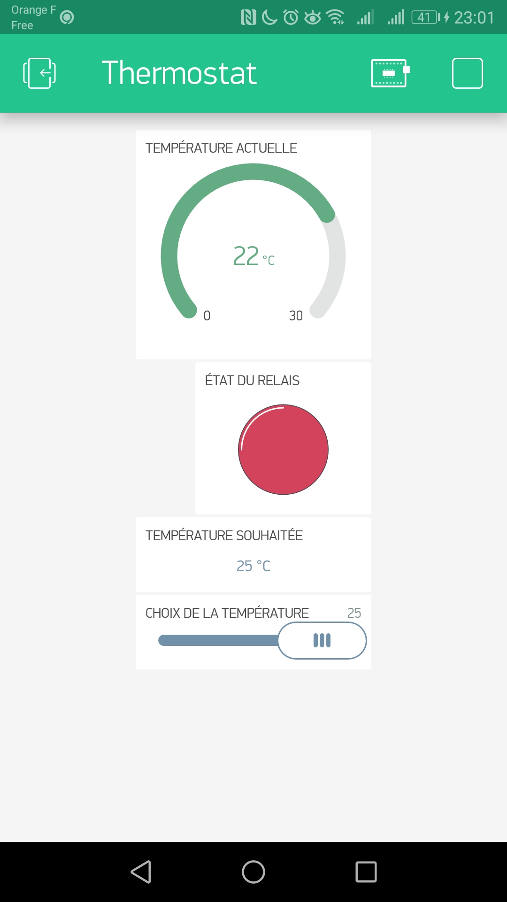

Example :

Trace moniteur série :

22:59:51.009 -> temperature relevée :22°C < température voulue : 25°C, on chauffe !

22:59:53.371 -> temperature voulue :16 °C

23:00:01.267 -> temperature relevée :22°C > température voulue : 16°C, on ne chauffe pas !

23:00:03.802 -> temperature voulue :25 °C

23:00:11.199 -> temperature relevée :22°C < température voulue : 25°C, on chauffe !

Screenshot Blynk Android :

